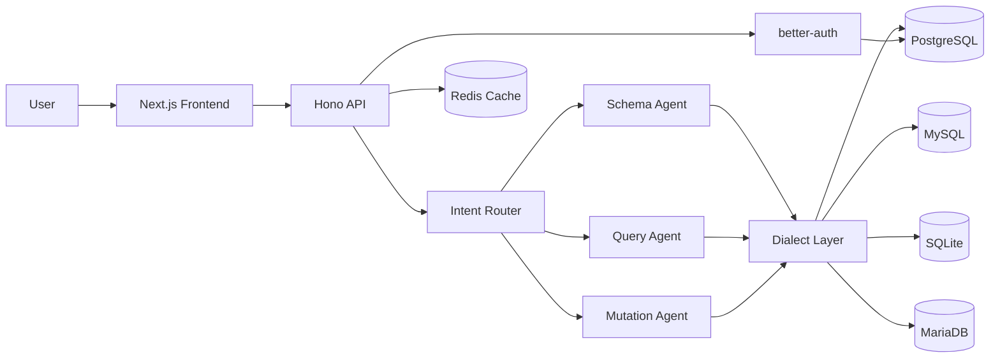

# ChatDB — AI-Powered Database Assistant

Open-source conversational interface for your databases. Ask questions in natural language, get SQL queries and results.

## Features

- **Natural Language → SQL** — Multi-LLM support (OpenAI, Anthropic, Ollama, Mistral)
- **Multi-Database** — PostgreSQL, MySQL, SQLite, MariaDB — one unified interface
- **Intelligent Agent Routing** — Schema analysis, query building, mutations
- **RBAC** — Role-based access control with database access modes
- **Mutation Support** — Write operations with confirmation UI
- **Audit Logging** — Full traceability of every query
- **Real-time Streaming** — Responses streamed as they generate

## Tech Stack

| Layer | Technology |
|-------|-----------|
| Frontend | Next.js 16, React 19, Tailwind CSS 4, shadcn/ui |
| Backend | Hono, Drizzle ORM |
| Database | PostgreSQL 16 |
| Cache | Redis 7 |
| Auth | better-auth |
| AI | AI SDK (Vercel), OpenAI, Anthropic, Ollama, Mistral |

## Quick Start

### Prerequisites

- [Bun](https://bun.sh) >= 1.0
- PostgreSQL 16
- Redis 7
- An LLM API key (OpenAI, Anthropic, Mistral, or local Ollama)

### Setup

```bash
git clone https://github.com/YOUR_USERNAME/chatdb.git
cd chatdb
bun install

# Configure environment
cp apps/api/.env.example apps/api/.env
cp apps/web/.env.example apps/web/.env
# Edit .env files with your credentials

# Setup database
cd apps/api
bunx drizzle-kit migrate
bun run db:seed
cd ../..

# Start development
bun run dev
```

Open [https://chatdb.pulseview.app](https://chatdb.pulseview.app) for the web app and [http://localhost:3001](http://localhost:3001) for the API.

### Docker

```bash
docker compose up -d
```

See [docker-compose.yml](./docker-compose.yml) for the full stack setup.

## Architecture



## Contributing

See [CONTRIBUTING.md](./CONTRIBUTING.md).

## License

[MIT](./LICENSE)
