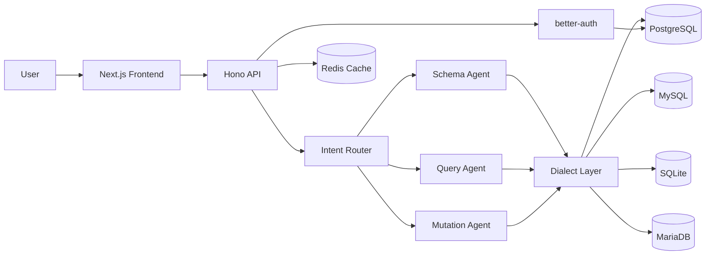

# ChatDB — AI-Powered Database Assistant

> Open-source conversational interface for your databases. Ask questions in natural language, get SQL queries and live results.

**Live demo:** [chatdb.pulseview.app](https://chatdb.pulseview.app)

---

## Features

- **Natural Language → SQL** — Ask in plain English, get accurate SQL back
- **Multi-LLM** — OpenAI, Anthropic, Mistral, and local Ollama
- **Multi-Database** — PostgreSQL, MySQL, SQLite, MariaDB from one interface
- **Intelligent Agent Routing** — Separate agents for schema analysis, query building, and write operations
- **RBAC** — Role-based access control with per-database permission modes
- **Mutation Support** — INSERT / UPDATE / DELETE with a confirmation step
- **Audit Logging** — Full trace of every query executed
- **Real-time Streaming** — Responses stream as they are generated

## Tech Stack

| Layer    | Technology                                            |
|----------|-------------------------------------------------------|
| Frontend | Next.js 16, React 19, Tailwind CSS 4, shadcn/ui       |
| Backend  | Hono, Drizzle ORM                                     |
| Database | PostgreSQL 16                                         |
| Cache    | Redis 7                                               |
| Auth     | better-auth                                           |
| AI       | Vercel AI SDK — OpenAI, Anthropic, Ollama, Mistral    |

## Project Structure

```
chatdb/
├── apps/
│   ├── api/        # Hono backend — REST API + AI agents
│   ├── web/        # Next.js main app (chat interface)
│   └── landing/    # Next.js landing page
└── packages/
    └── shared/     # Shared types and i18n messages
```

## Quick Start

### Prerequisites

- [Bun](https://bun.sh) >= 1.0
- PostgreSQL 16
- Redis 7
- An API key for at least one LLM provider (OpenAI, Anthropic, or Mistral), or a running Ollama instance

### Setup

```bash
git clone https://github.com/MakFly/chatdb.git
cd chatdb
bun install

# Copy and fill in environment files
cp apps/api/.env.example apps/api/.env
cp apps/web/.env.example apps/web/.env
# Edit both .env files with your credentials

# Run database migrations and seed initial data
cd apps/api
bunx drizzle-kit migrate
bun run db:seed
cd ../..

# Start all services in development mode
bun run dev
```

| Service | URL                   |
|---------|-----------------------|
| Web app | http://localhost:3150 |
| API     | http://localhost:3333 |

### Environment Variables

**`apps/api/.env`**

| Variable               | Description                                          |
|------------------------|------------------------------------------------------|
| `DATABASE_URL`         | PostgreSQL connection string                         |
| `REDIS_URL`            | Redis connection string                              |
| `BETTER_AUTH_SECRET`   | Secret key for authentication                        |
| `BETTER_AUTH_URL`      | Public URL of the API                                |
| `PORT`                 | API server port (default: `3333`)                    |
| `ENCRYPTION_KEY`       | Key used to encrypt stored database credentials      |

**`apps/web/.env`**

| Variable              | Description           |
|-----------------------|-----------------------|
| `NEXT_PUBLIC_API_URL` | URL of the API server |

### Docker

```bash
docker compose up -d
```

See [docker-compose.yml](./docker-compose.yml) for the full stack configuration.

## Available Scripts

```bash
# Development
bun run dev           # Start API + Web in parallel
bun run dev:api       # Start API only
bun run dev:web       # Start Web only

# Build
bun run build         # Build all apps for production

# Database
bun run db:generate   # Generate a new migration after schema changes
bun run db:migrate    # Apply pending migrations
bun run db:seed       # Seed the database (idempotent)
bun run db:reset      # Reset and re-seed the database
bun run db:studio     # Open Drizzle Studio (database UI)
```

## Architecture



## Contributing

See [CONTRIBUTING.md](./CONTRIBUTING.md).

## License

[MIT](./LICENSE)
